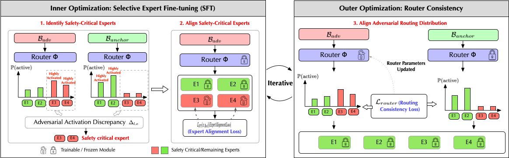

## RASA: Routing-Aware Safety Alignment for Mixture-of-Experts Models


[](https://arxiv.org/abs/2602.04448)
[](https://scholar.google.com/citations?user=Qsp7ts0AAAAJ)


### TL;DR

We show that MoE safety alignment can fail via routing shortcuts, and propose RASA—a routing-aware, expert-level alignment method that directly repairs safety-critical experts to achieve robust jailbreak defense without hurting general performance.

### Abstract

Mixture-of-Experts (MoE) language models introduce unique challenges for safety alignment due to their sparse routing mechanisms, which can enable degenerate optimization behaviors under standard full-parameter fine-tuning. In our preliminary experiments, we observe that naively applying full-parameter safety fine-tuning to MoE models can reduce attack success rates through routing or expert dominance effects, rather than by directly repairing safety-critical experts. To address this challenge, we propose RASA, a routing-aware expert-level alignment framework that explicitly repairs safety-critical experts while preventing routing-based bypasses. RASA identifies experts disproportionately activated by successful jailbreaks, selectively fine-tunes only these experts under fixed routing, and subsequently enforces routing consistency with safety-aligned contexts. Across two representative MoE architectures and a diverse set of jailbreak attacks, RASA achieves near-perfect robustness, strong cross-attack generalization, and substantially reduced over-refusal, while preserving general capabilities on benchmarks such as MMLU, GSM8K, and TruthfulQA. Our results suggest that robust MoE safety alignment benefits from targeted expert repair rather than global parameter updates, offering a practical and architecture-preserving alternative to prior approaches.

## Repository Overview

This repository contains scripts for reproducing the main RASA experiments on two MoE architectures:

- `OLMoE-1B-7B-0125-Instruct`
- `Qwen3-30B-A3B`

We provide end-to-end scripts that (1) detect safety-critical experts, (2) run routing-aware expert-level optimization, and (3) evaluate robustness and utility across a suite of jailbreak and capability benchmarks.

## Environment & Data

- Python environment with CUDA-enabled PyTorch.
- Multiple GPUs are recommended (scripts assume at least 2–4 GPUs).
- Datasets for jailbreak attacks and evaluations should be preprocessed into:
  - `experiments/{attack}/olmoe_train.json`, `experiments/{attack}/olmoe_test.json`
  - `experiments/{attack}/qwen_train.json`, `experiments/{attack}/qwen_test.json`
- Evaluation code is expected at:
  - `SteerMoE/3_evaluation/evaluation_example.py`

Set the working directory in the scripts via:

```bash
work_dir="~/RASAMoE"
```

or adjust to your local path.

## Quick Start

From the project root:

```bash
# OLMoE experiments
bash shell/olmoe.sh > shell/olmoe.log 2>&1

# Qwen3-30B-A3B experiments
bash shell/qwen.sh > shell/qwen.log 2>&1
```

Each script will iterate over predefined jailbreak attacks (e.g., `johnny`, `flipattack`, `deepinception`), run expert detection, perform RASA training, and then evaluate robustness and utility.


## Important Parameters

- `attacks`: which jailbreak attack datasets to run (e.g., `johnny`, `flipattack`, `deepinception`).
- `expert`: number of safety-critical experts selected (`unsafe_expert_top_k`).
- `unsafe_expert_top_k`: how many top unsafe experts (by activation / failure signal) to repair.
- `batch_unsafe_threshold`, `global_unsafe_threshold`: thresholds for identifying unsafe behavior when detecting experts.
- `num_rounds`: number of alternating optimization rounds between experts and router.
- `expert_epochs_per_round`, `router_epochs_per_round`: how much expert vs. router training per round (controls emphasis on expert repair vs. routing).
- `expert_lr`, `router_lr`: learning rates for expert parameters and router parameters.
- `kl_type`: KL divergence type (e.g., `forward`) used to regularize updates.
- `tensor_parallel_size`: number of GPUs used for tensor-parallel inference during evaluation.
- `CUDA_VISIBLE_DEVICES`: which GPU IDs are used; you must adapt this to your own hardware.
- `work_dir`, `output_dir`, `batch_data_path`, `*_path`: file system paths; adjust if your directory layout differs.
- `--skip_router_training`, `--full_param_training`, `--skip_expert_training`: Ablation Experiments


## Citation


```
@misc{liang2026rasaroutingawaresafetyalignment,
      title={RASA: Routing-Aware Safety Alignment for Mixture-of-Experts Models}, 
      author={Jiacheng Liang and Yuhui Wang and Tanqiu Jiang and Ting Wang},
      year={2026},
      eprint={2602.04448},
      archivePrefix={arXiv},
      primaryClass={cs.LG},
      url={https://arxiv.org/abs/2602.04448}, 
}
```